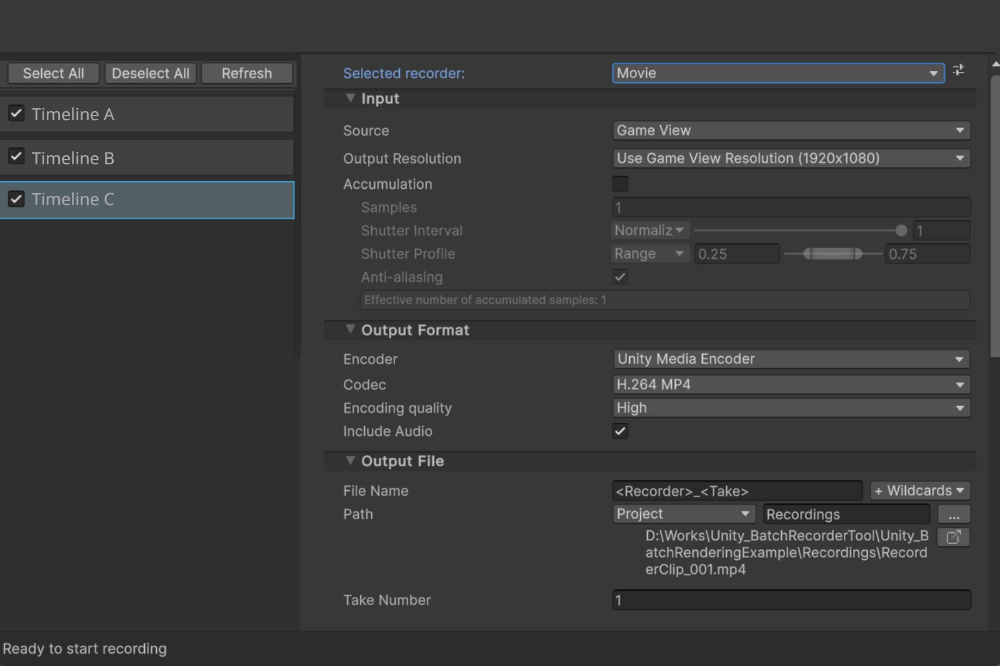

# Unity Batch Rendering Toolのアップデート

## アップデートの指針
- Unity Recorderで設定できるRenderingのすべてのオプションへの対応
  - Movie書き出し
  - Animation書き出し
  - Alembic書き出し
  - AOV書き出し
- Timelineごとに細かい書き出し設定を可能にする
  - TimelineAを指定し、シーン内のGameObject CをAlembicで書き出し、など
- 書き出し設定の保存機能
  - 他の作業者も同様のルールで一括で書き出せるようにする
- UIの改修
  - Unity RecorderのUIを踏襲
  - 踏襲しつつ、バッチレンダリング向けに最適化
  - 