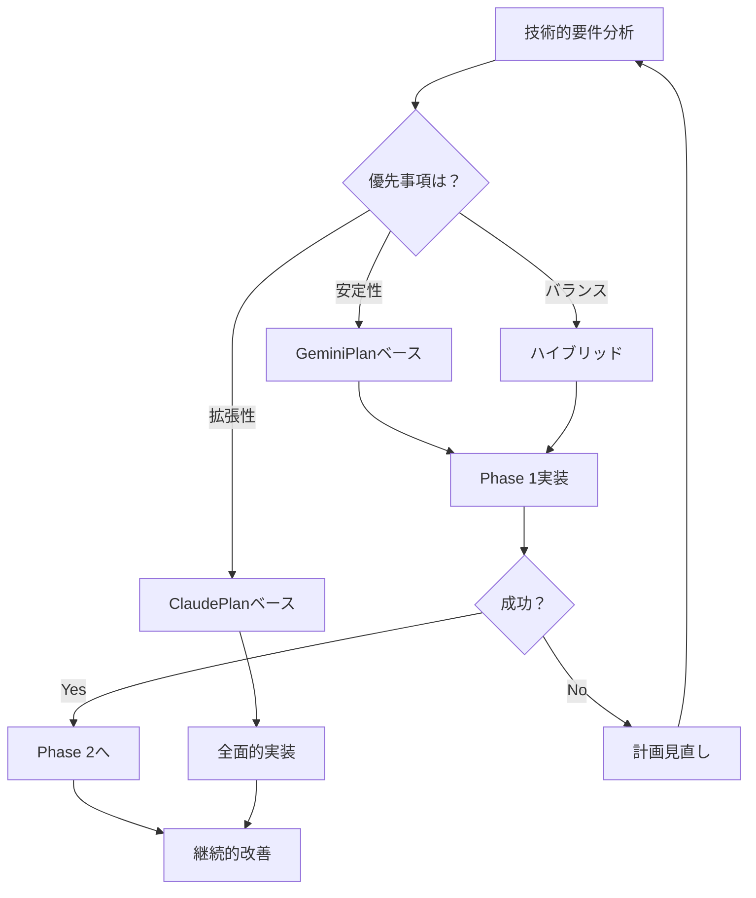

# 技術的意思決定マトリックス

## 📋 概要

このドキュメントは、Unity Multi Timeline Recorderのリファクタリングにおける技術的選択肢を評価し、意思決定を支援するための包括的なマトリックスです。

## 🔍 評価基準の定義

### **重要度レベル**
- **Critical (C)**: プロジェクトの成功に不可欠
- **High (H)**: 重要だが代替案あり
- **Medium (M)**: 望ましいが必須ではない
- **Low (L)**: あれば良い程度

### **評価スコア**
- ⭐⭐⭐⭐⭐: 優秀（90-100%）
- ⭐⭐⭐⭐: 良好（70-89%）
- ⭐⭐⭐: 普通（50-69%）
- ⭐⭐: 不十分（30-49%）
- ⭐: 不適切（0-29%）

## 📊 アーキテクチャパターン比較

### **1. 全体アーキテクチャ**

| パターン | 実装容易性 | 保守性 | 拡張性 | テスト性 | Unity適合性 | 総合評価 |
|---------|-----------|--------|--------|----------|-------------|----------|
| **MVC (GeminiPlan)** | ⭐⭐⭐⭐⭐ | ⭐⭐⭐⭐ | ⭐⭐⭐ | ⭐⭐⭐⭐ | ⭐⭐⭐⭐⭐ | **4.2** |
| **MVP + Plugin (ClaudePlan)** | ⭐⭐⭐ | ⭐⭐⭐⭐⭐ | ⭐⭐⭐⭐⭐ | ⭐⭐⭐⭐⭐ | ⭐⭐⭐ | **4.2** |
| **MVVM** | ⭐⭐ | ⭐⭐⭐⭐ | ⭐⭐⭐⭐ | ⭐⭐⭐⭐ | ⭐⭐ | **3.2** |
| **Clean Architecture** | ⭐ | ⭐⭐⭐⭐⭐ | ⭐⭐⭐⭐⭐ | ⭐⭐⭐⭐⭐ | ⭐ | **3.2** |
| **Monolithic (現状)** | ⭐⭐⭐⭐⭐ | ⭐ | ⭐ | ⭐ | ⭐⭐⭐ | **2.2** |

**推奨**: MVC (短期) → MVP + Plugin (長期)

### **2. プラグインシステム設計**

| アプローチ | 実装コスト | 柔軟性 | パフォーマンス | 開発者体験 | 総合評価 |
|-----------|-----------|--------|---------------|------------|----------|
| **Interface-based (ClaudePlan)** | ⭐⭐⭐⭐ | ⭐⭐⭐⭐⭐ | ⭐⭐⭐⭐ | ⭐⭐⭐⭐⭐ | **4.5** |
| **Reflection-based** | ⭐⭐⭐ | ⭐⭐⭐⭐⭐ | ⭐⭐ | ⭐⭐⭐ | **3.25** |
| **ScriptableObject-based** | ⭐⭐⭐⭐⭐ | ⭐⭐⭐ | ⭐⭐⭐⭐⭐ | ⭐⭐⭐⭐ | **4.25** |
| **Attribute-based** | ⭐⭐⭐ | ⭐⭐⭐⭐ | ⭐⭐⭐ | ⭐⭐⭐⭐ | **3.5** |

**推奨**: Interface-based with ScriptableObject integration

### **3. 通信メカニズム**

| 方式 | 疎結合度 | デバッグ性 | パフォーマンス | 学習曲線 | 総合評価 |
|------|----------|-----------|---------------|----------|----------|
| **Event/Action (GeminiPlan)** | ⭐⭐⭐⭐ | ⭐⭐⭐⭐ | ⭐⭐⭐⭐⭐ | ⭐⭐⭐⭐⭐ | **4.5** |
| **UniRx (Reactive)** | ⭐⭐⭐⭐⭐ | ⭐⭐⭐ | ⭐⭐⭐⭐ | ⭐⭐ | **3.5** |
| **Message Bus** | ⭐⭐⭐⭐⭐ | ⭐⭐ | ⭐⭐⭐ | ⭐⭐⭐ | **3.25** |
| **Direct Coupling (現状)** | ⭐ | ⭐⭐⭐⭐⭐ | ⭐⭐⭐⭐⭐ | ⭐⭐⭐⭐⭐ | **3.5** |

**推奨**: Event/Action (C#標準)

## 🛠️ 技術スタック選択

### **4. 依存性管理**

| ツール | 複雑性 | 機能性 | Unity統合 | コミュニティ | 総合評価 |
|--------|--------|--------|-----------|-------------|----------|
| **Manual DI** | ⭐⭐⭐⭐⭐ | ⭐⭐⭐ | ⭐⭐⭐⭐⭐ | ⭐⭐⭐ | **4.0** |
| **Zenject/Extenject** | ⭐⭐ | ⭐⭐⭐⭐⭐ | ⭐⭐⭐⭐ | ⭐⭐⭐⭐ | **3.75** |
| **VContainer** | ⭐⭐⭐ | ⭐⭐⭐⭐ | ⭐⭐⭐⭐⭐ | ⭐⭐⭐ | **3.75** |
| **Pure DI** | ⭐⭐⭐⭐ | ⭐⭐ | ⭐⭐⭐ | ⭐⭐ | **2.75** |

**推奨**: Manual DI (初期) → VContainer (成熟後)

### **5. テストフレームワーク**

| フレームワーク | 設定容易性 | 機能充実度 | CI/CD統合 | 実行速度 | 総合評価 |
|---------------|-----------|-----------|-----------|----------|----------|
| **Unity Test Framework** | ⭐⭐⭐⭐⭐ | ⭐⭐⭐ | ⭐⭐⭐⭐ | ⭐⭐⭐ | **3.75** |
| **NUnit (直接)** | ⭐⭐ | ⭐⭐⭐⭐⭐ | ⭐⭐⭐⭐⭐ | ⭐⭐⭐⭐⭐ | **4.25** |
| **xUnit** | ⭐ | ⭐⭐⭐⭐ | ⭐⭐⭐⭐⭐ | ⭐⭐⭐⭐⭐ | **3.75** |
| **Custom Framework** | ⭐ | ⭐⭐ | ⭐⭐ | ⭐⭐⭐ | **2.0** |

**推奨**: Unity Test Framework

### **6. 非同期処理**

| アプローチ | 使いやすさ | パフォーマンス | Unity互換性 | デバッグ性 | 総合評価 |
|-----------|-----------|---------------|------------|-----------|----------|
| **async/await + UniTask** | ⭐⭐⭐⭐⭐ | ⭐⭐⭐⭐⭐ | ⭐⭐⭐⭐⭐ | ⭐⭐⭐⭐ | **4.75** |
| **Coroutines (現状)** | ⭐⭐⭐⭐ | ⭐⭐⭐ | ⭐⭐⭐⭐⭐ | ⭐⭐ | **3.5** |
| **純粋async/await** | ⭐⭐⭐⭐ | ⭐⭐⭐⭐ | ⭐⭐ | ⭐⭐⭐⭐⭐ | **3.75** |
| **Job System** | ⭐⭐ | ⭐⭐⭐⭐⭐ | ⭐⭐⭐ | ⭐⭐ | **3.0** |

**推奨**: async/await + UniTask

## 📈 実装戦略比較

### **7. 移行アプローチ**

| 戦略 | リスク | 期間 | コスト | 品質保証 | 総合評価 |
|------|--------|------|--------|----------|----------|
| **段階的移行 (推奨)** | ⭐⭐⭐⭐ | ⭐⭐⭐ | ⭐⭐⭐⭐ | ⭐⭐⭐⭐⭐ | **4.0** |
| **ビッグバン** | ⭐ | ⭐⭐⭐⭐⭐ | ⭐⭐ | ⭐⭐ | **2.5** |
| **並行開発** | ⭐⭐ | ⭐⭐ | ⭐ | ⭐⭐⭐ | **2.0** |
| **部分的改修** | ⭐⭐⭐⭐⭐ | ⭐ | ⭐⭐⭐⭐⭐ | ⭐⭐⭐ | **3.5** |

**推奨**: 段階的移行

### **8. ドキュメント戦略**

| アプローチ | 初期投資 | 保守性 | 開発者採用 | 自動化可能性 | 総合評価 |
|-----------|----------|--------|-----------|-------------|----------|
| **XML Documentation** | ⭐⭐⭐⭐ | ⭐⭐⭐⭐⭐ | ⭐⭐⭐⭐⭐ | ⭐⭐⭐⭐⭐ | **4.75** |
| **Markdown + Wiki** | ⭐⭐⭐⭐⭐ | ⭐⭐⭐ | ⭐⭐⭐⭐ | ⭐⭐ | **3.5** |
| **DocFX** | ⭐⭐⭐ | ⭐⭐⭐⭐ | ⭐⭐⭐ | ⭐⭐⭐⭐⭐ | **3.75** |
| **Unity Documentation** | ⭐⭐ | ⭐⭐⭐⭐⭐ | ⭐⭐ | ⭐ | **2.5** |

**推奨**: XML Documentation + Generated API Docs

## 🎯 技術選択の決定木

### **優先順位に基づく選択**

#### **最優先: 安定性と保守性**
```
選択:
├─ アーキテクチャ: MVC (GeminiPlan)
├─ 通信: Event/Action
├─ テスト: Unity Test Framework
└─ 移行: 段階的
```

#### **優先: 拡張性とエコシステム**
```
選択:
├─ アーキテクチャ: MVP + Plugin (ClaudePlan)
├─ プラグイン: Interface-based
├─ DI: VContainer
└─ 非同期: UniTask
```

#### **バランス型（推奨）**
```
Phase 1 (0-6ヶ月):
├─ アーキテクチャ: MVC
├─ 通信: Event/Action
├─ テスト: Unity Test Framework
└─ 移行: 段階的

Phase 2 (6-12ヶ月):
├─ プラグイン: Interface-based
├─ DI: Manual → VContainer
├─ 非同期: Coroutine → UniTask
└─ ドキュメント: XML Documentation
```

## 📋 リスク評価マトリックス

### **技術的リスク**

| リスク項目 | 発生確率 | 影響度 | リスクレベル | 軽減策 |
|-----------|---------|--------|-------------|--------|
| Unity API変更 | Medium | High | **高** | 抽象化レイヤー |
| パフォーマンス劣化 | Low | High | **中** | プロファイリング |
| 後方互換性破壊 | Medium | Critical | **極高** | 互換性レイヤー |
| プラグイン競合 | Low | Medium | **低** | 名前空間分離 |

### **プロジェクトリスク**

| リスク項目 | 発生確率 | 影響度 | リスクレベル | 軽減策 |
|-----------|---------|--------|-------------|--------|
| スケジュール遅延 | High | Medium | **高** | バッファ確保 |
| スコープクリープ | Medium | High | **高** | 厳格なフェーズゲート |
| 技術的負債増加 | Low | High | **中** | コードレビュー |
| チーム離脱 | Low | Critical | **高** | 知識共有 |

## 🔄 意思決定プロセス

### **ステークホルダーマトリックス**

| ステークホルダー | 影響力 | 関心度 | 関与戦略 |
|----------------|--------|--------|----------|
| 開発チーム | High | High | **積極的関与** |
| プロダクトオーナー | High | Medium | **定期報告** |
| エンドユーザー | Low | High | **情報提供** |
| サードパーティ開発者 | Medium | High | **コミュニティ構築** |

### **意思決定フロー**



## 📊 ROI分析

### **投資対効果予測**

| 項目 | 初期投資 | 6ヶ月後 | 12ヶ月後 | 18ヶ月後 |
|------|---------|---------|----------|----------|
| 開発工数 | -100% | -20% | -60% | -80% |
| バグ修正時間 | - | -30% | -60% | -75% |
| 新機能追加 | - | -40% | -70% | -85% |
| 保守コスト | - | -25% | -50% | -70% |

### **ブレークイーブンポイント**
- **楽観的シナリオ**: 8ヶ月
- **現実的シナリオ**: 12ヶ月
- **悲観的シナリオ**: 18ヶ月

## 🎬 最終推奨事項

### **技術スタック決定**

```yaml
Phase 1 (即時実装):
  Architecture: MVC (GeminiPlan inspired)
  Communication: C# Events/Actions
  Testing: Unity Test Framework
  Async: Coroutines (existing)
  
Phase 2 (6ヶ月後):
  Plugins: Interface-based system
  DI: Manual with VContainer preparation
  Async: Migration to UniTask
  Docs: XML Documentation
  
Phase 3 (12ヶ月後):
  Architecture: Full MVP + Plugin
  DI: VContainer
  API: Public plugin API
  Ecosystem: Plugin marketplace ready
```

### **成功の鍵**

1. **段階的実装**を厳守
2. **テストファースト**開発
3. **継続的なドキュメント**更新
4. **定期的なレビュー**サイクル
5. **コミュニティフィードバック**の活用

---

**作成日**: 2025年7月13日  
**承認状況**: レビュー待ち  
**次回更新**: Phase 1完了時